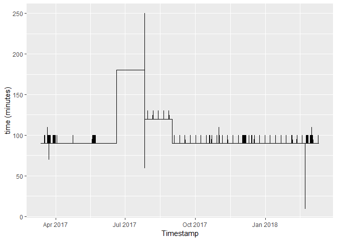

[](https://www.repostatus.org/#wip)
[](https://www.gnu.org/licenses/gpl-3.0.en.html)

-----

[](https://cran.r-project.org/)
[](https://cran.r-project.org/package=oddwater)
[](commits/master)

-----

[](/commits/master)

[](https://travis-ci.org/pridiltal/oddwater)

<!-- README.md is generated from README.Rmd. Please edit that file -->

# oddwater

We propose a framework to detect anomalies in water quality sensor data.

This package is still under development and this repository contains a
development version of the R package *oddwater*.

## Installation

You can install oddwater from github with:

``` r
# install.packages("devtools")
devtools::install_github("pridiltal/oddwater")
```

## Example

### Data Preprocessing. These outliers were confirmed by DES

``` r
library(tidyverse)
library(oddwater)
#Label data
# Outliers confirmed by DES
outliers <- c("22-03-17 10:00", "05-04-17 7:20", "13-06-17 4:50", "03-11-17 7:50", "26-07-17 16:00")
# Neighbours of those outliers
neighbours <- c("22-03-17 11:10", "05-04-17 8:50", "13-06-17 6:20", "26-07-17 15:00", "03-11-17 9:20")
# label points as outliers or typical
sandy_creek$type <- ifelse( (sandy_creek$Timestamp  %in% outliers ), "outlier", "typical")
neighbour <- which(sandy_creek$Timestamp  %in% neighbours )
sandy_creek$type[neighbour] <- "neighbour"
```

### Transform data

``` r
data <- sandy_creek[,c("Timestamp", "Lsonde_Cond_uscm", "Lsonde_Turb_NTU",      
                       "Lsonde_Level_m")] %>% drop_na()
trans_data <-oddwater::transform_data(data)
#> Warning in log(data_var): NaNs produced
#> Warning: All formats failed to parse. No formats found.

#> Warning: All formats failed to parse. No formats found.
head(trans_data)
#>        Timestamp Lsonde_Cond_uscm Lsonde_Turb_NTU Lsonde_Level_m
#> 2  12-03-17 1:00           326.34           34.47          0.636
#> 4  12-03-17 2:30           326.63           34.06          0.636
#> 6  12-03-17 4:00           327.00           33.39          0.635
#> 8  12-03-17 5:30           327.31           32.61          0.633
#> 10 12-03-17 7:00           327.81           33.34          0.634
#> 12 12-03-17 8:30           328.70           32.22          0.631
#>    log_Lsonde_Cond_uscm log_Lsonde_Turb_NTU log_Lsonde_Level_m
#> 2              5.787940            3.540089         -0.4525567
#> 4              5.788828            3.528124         -0.4525567
#> 6              5.789960            3.508256         -0.4541303
#> 8              5.790908            3.484619         -0.4572849
#> 10             5.792434            3.506758         -0.4557063
#> 12             5.795145            3.472587         -0.4604494
#>    diff_log_Lsonde_Cond_uscm diff_log_Lsonde_Turb_NTU
#> 2                         NA                       NA
#> 4               0.0008882491              -0.01196571
#> 6               0.0011321391              -0.01986722
#> 8               0.0009475632              -0.02363746
#> 10              0.0015264382               0.02213889
#> 12              0.0027113084              -0.03417050
#>    diff_log_Lsonde_Level_m der_log_bound_Lsonde_Cond_uscm
#> 2                       NA                             NA
#> 4              0.000000000                             NA
#> 6             -0.001573564                             NA
#> 8             -0.003154577                             NA
#> 10             0.001578532                             NA
#> 12            -0.004743092                             NA
#>    der_log_bound_Lsonde_Turb_NTU der_log_bound_Lsonde_Level_m
#> 2                             NA                           NA
#> 4                             NA                           NA
#> 6                             NA                           NA
#> 8                             NA                           NA
#> 10                            NA                           NA
#> 12                            NA                           NA
#>    neg_der_log_bounded_turb pos_der_log_bounded_cond
#> 2                        NA                       NA
#> 4                        NA                       NA
#> 6                        NA                       NA
#> 8                        NA                       NA
#> 10                       NA                       NA
#> 12                       NA                       NA
#>    neg_der_log_bounded_level time
#> 2                         NA   NA
#> 4                         NA   NA
#> 6                         NA   NA
#> 8                         NA   NA
#> 10                        NA   NA
#> 12                        NA   NA
```

### Visualize time gap

`sandy_creek` data is an irregular time series

``` r
trans_data <- trans_data %>% drop_na()
p <- ggplot(trans_data, aes(x= Timestamp, y= time))+
      geom_line()+
      ylab("time (minutes)")
print(p)
```

<!-- -->

### Visualize original data

``` r
plot_var <- dplyr::left_join(trans_data, sandy_creek, by = "Timestamp")

plot_var <- trans_data[, c("Timestamp", "Lsonde_Cond_uscm",   
                           "Lsonde_Turb_NTU", "Lsonde_Level_m" )] %>% drop_na()
oddwater::plot_series(plot_var, title = "original series") 
oddwater::plot_pairs(plot_var)
```

### Visualize transformed data

``` r
plot_var <- trans_data[, c("Timestamp", "type", "neg_der_log_bounded_turb",
                           "pos_der_log_bounded_cond", "neg_der_log_bounded_level")] %>% drop_na()
colnames(plot_var) <- abbreviate(colnames(plot_var), minlength=20)
oddwater::plot_series(plot_var, title = "Non linear transformation - one side log derivatives (bounded")
oddwater::plot_pairs(plot_var)
```

### Compute performance metrics

``` r
# Generate a toy dataset
true_labels <- c("out", "out", "normal", "out", "normal", "normal", "normal", "normal", "normal", "normal")
output <-  c("out", "normal", "normal", "normal", "out", "out", "normal", "normal", "normal", "normal")
# Compute performance metrics 
out<- calc_performance_metrics(y_truth = true_labels, y_output = output, pos_label = "out", neg_label = "normal")
#>                      Value
#> TN                  5.0000
#> FN                  2.0000
#> FP                  2.0000
#> TP                  1.0000
#> Accuracy            0.6000
#> Error_Rate          0.4000
#> Sensitivity         0.3333
#> Specificity         0.7143
#> Precision           0.3333
#> Recall              0.1667
#> F_Measure           0.2222
#> Optimised_Precision 0.2364
```

Compute Means square Error

``` r
clac_MSE(true_y, pred_y)
```

## Further Details

``` r
?oddwater
```
